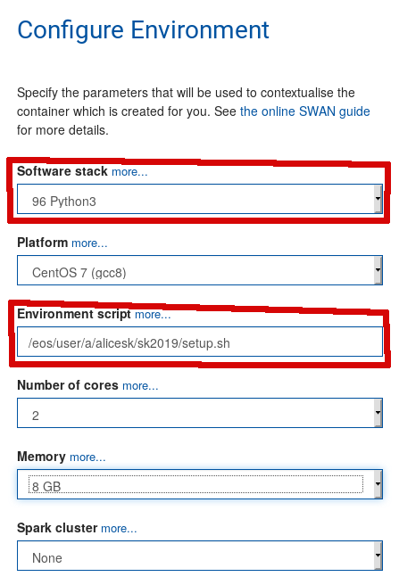
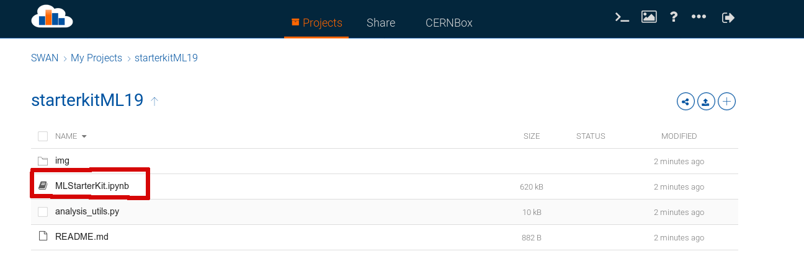

# starterkitML19

Welcome at the ALICE ML tutorial. Before we start some preliminary steps are needed. Follow them heareafter!

## SWAN setup

We will run this tutorial on CERN SWAN, so click here

to go to SWAN and automatically download this repository.

To have the right environment configure SWAN in this way:

- **Software stack**: 96 Python3
- **Environment script**: /eos/user/a/alicesk/sk2019/setup.sh

You should have this setup

## Open the notebook

Now open the notebook `MLStarterKit.ipynb` .

