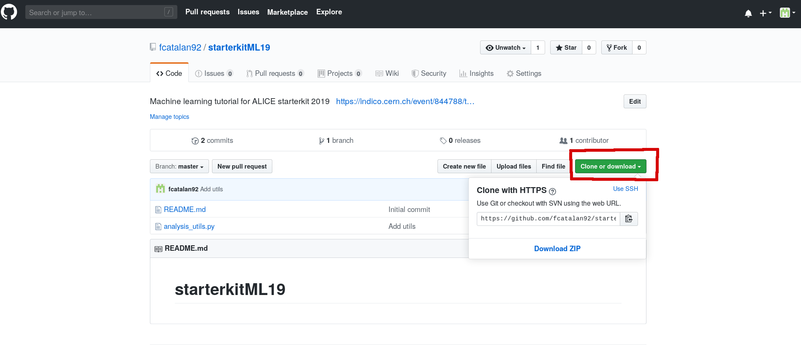

# starterkitML19

Welcome at the ALICE ML tutorial. Before we start some preliminary steps are needed. Follow them heareafter!

## SWAN setup

We will run this tutorial on CERN SWAN, so go to <https://swan.cern.ch> and login.

To have the right environment configure SWAN in this way:

- **Software stack**: 96 Python3
- **Environment script**: /eos/user/a/alicesk/sk2019/setup.sh

You should have this setup

## Clone this tutorial

Now we need to clone the files used for the tutorial. Click on the download button

and insert the repository url <https://github.com/fcatalan92/starterkitML19> adding .git at the end.

You can get the full path to clone here

## Open the notebook

Now enter in `starterkitML19' and open the notebook.
